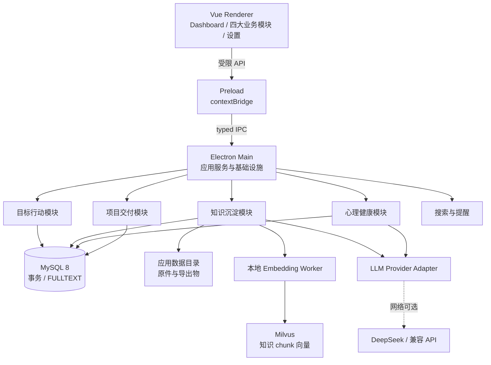
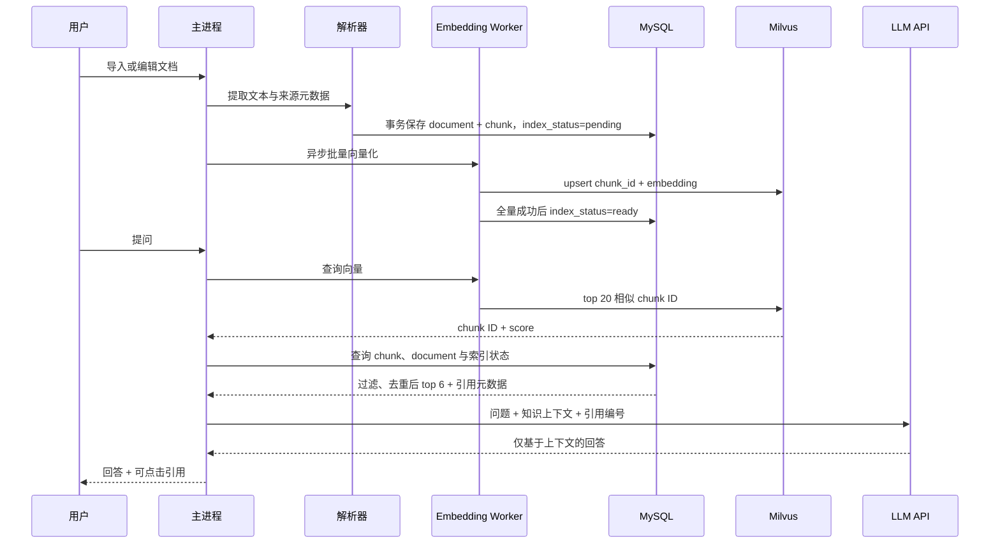

# 人生系统架构设计文档与技术选型方案

**状态**：提议中  
**日期**：2026-08-18  
**依据**：[设计文档](设计文档.md)、[PRD 与功能优先级](../PRD&功能优先级.md)；冲突时以前者为准。

## 1. 目标、约束与假设

### 1.1 架构目标

系统服务单一用户的本地目标管理、知识沉淀、回顾和项目交付。架构首先保证：

1. MySQL 与 Milvus 连接信息由用户在设置页直接配置（默认本地部署；**部署拓扑不属于软件设计范围，连接可达性由用户负责**）。连接可用且没有公网、没有 LLM 密钥时，所有非 AI 数据录入、浏览、基础检索、导入导出与备份仍可用；应用提供连接测试与健康检查，服务不可达时明确提示并引导到设置页。
2. 目标进度只由数据点和里程碑驱动，待办/习惯不能反向计算目标进度。
3. RAG 只检索知识库；情绪数据绝不进入索引、上下文或 LLM 请求。
4. 本地数据和索引的变更可恢复、可追踪，不因后台索引失败而丢失原始文档。
5. 在功能持续增加时，改动应局限在一个业务模块和共享端口内。

### 1.2 不做的事

不设计微服务、远端账户、多端同步、协作、外部推送或自动执行 AI 建议。它们会引入身份、冲突解决、权限和分布式一致性问题，均不属于当前产品约束。

### 1.3 明确假设

| 假设 | 影响 | 验证方式 |
|---|---|---|
| 用户数据量为数千文档、数万 chunk 级别 | MySQL 与 Milvus 单机实例足够 | 用 1 万 chunk 基准数据测量导入和检索时间 |
| 桌面目标平台至少为 Windows | MySQL、Milvus 与 ONNX Runtime 的本机服务/连接需先验证 | 本机部署与断网（无公网）验证 |
| 文件导入时允许复制原件到应用数据目录 | 原文件被移动后仍可溯源和重新解析 | 产品确认存储策略与磁盘上限 |
| LLM API 仅接收明确选中的知识 chunk 或情绪周报聚合数据 | 满足隐私和离线边界 | 在 API 日志中审计请求构造 |

## 2. 总体架构

### 2.1 选择：模块化单体

采用 Electron 应用内的模块化单体。每个业务模块拥有应用服务、领域规则、仓储端口和 UI feature；共享的 MySQL、Milvus、文件系统、索引器和 LLM 客户端仅通过端口使用。此结构保持业务代码的单进程简单性，也为未来抽离数据访问服务留下边界。



### 2.2 Electron 进程职责与安全基线

| 位置 | 职责 | 禁止事项 |
|---|---|---|
| 渲染进程 | Vue 页面、表单校验、短暂 UI 状态、调用预加载公开的 API | 不访问 Node、MySQL、Milvus、文件系统、密钥或任意 IPC channel |
| Preload | `contextBridge.exposeInMainWorld` 暴露按领域分组且参数受校验的窄 API | 不暴露裸 `ipcRenderer`、`send` 或通用文件读写 |
| 主进程 | MySQL/Milvus 客户端、文件系统、导入导出、备份、索引任务、LLM 请求、通知调度 | 不承载 UI 状态或直接执行来自渲染端的任意路径/SQL |
| Worker Thread | ONNX embedding、批量分块，向主进程回传进度和结果 | 不触碰 Electron UI API |

安全基线：`contextIsolation: true`、`sandbox: true`、`nodeIntegration: false`、CSP 禁止未知外部脚本；所有 IPC 使用 `ipcMain.handle` 的白名单、Zod 参数校验和结构化返回值。文件选择只经主进程原生对话框；主进程将解析前后的路径限制在用户明确选择的文件或应用数据目录内。导航、新窗口、外部 URL 均走 allowlist。密钥只存操作系统安全存储（如 `safeStorage` 加密后的本地配置），不进入 Pinia、日志或备份。

不设置内置 HTTP/Node 服务。它会造成端口、生命周期、认证面和调试成本，但不提供当前需要的部署独立性；Worker Thread 已足够隔离模型推理。

### 2.3 限界上下文与依赖规则

| 上下文 | 拥有实体 | 可依赖的共享能力 | 不可直接写入 |
|---|---|---|---|
| 目标行动 | goal、goal_record、milestone、project、task、habit、habit_checkin | tags、提醒、导出 | 知识、情绪、开发项目表 |
| 知识沉淀 | inbox_item、document、chunk、vector、timeline_entry | 文件、搜索、LLM、tags | 情绪表 |
| 心理健康 | mood_word、mood_record、mood_report | LLM、统计、导出 | RAG、document、chunk/vector |
| 项目交付 | project_idea、dev_project、dev_project_stage | tags、导出 | 生活 project、task |
| 叙事关联 | entity_link | 各上下文只读实体摘要 | 目标或目标实体的业务字段 |

跨模块的唯一通用关系是 `entity_link`，它表示可回看的叙事引用，不能承担业务工作流。模块间调用只经过应用服务的查询端口，禁止跨模块仓储写入。`project`（生活项目）与 `dev_project`（开发项目）始终为不同聚合。

## 3. 核心技术选型

### 3.1 决策矩阵

| 决策点 | 候选 | 成本 | 复杂度 | 生态成熟度 | 推荐与理由 |
|---|---|---:|---:|---|
| 数据访问 | mysql2 直写 | 低 | 低 | 高 | 不单独采用：类型、迁移和查询复用不足 |
|  | Drizzle ORM + mysql2 | 低 | 中 | 高 | **推荐**：类型化 MySQL schema/迁移；FULLTEXT 和管理语句可通过原生 SQL 执行 |
|  | Prisma | 中 | 中高 | 高 | 不推荐：客户端引擎与 Electron 打包开销较大，对 Milvus 无额外收益 |
| UI 组件 | Element Plus | 低 | 低 | 高 | 推荐：桌面表格、表单、日期和无障碍能力成熟 |
|  | Naive UI | 低 | 中 | 中高 | 可选：主题定制更自由，团队若已熟悉可替换 |
| Markdown 编辑 | Milkdown | 低 | 中 | 高 | **推荐**：基于 ProseMirror，支持 Markdown 往返和扩展 |
|  | Toast UI | 低 | 低 | 高 | 备选：集成快，但复杂自定义能力较弱 |
| 打包 | electron-builder | 低 | 中 | 高 | **推荐**：原生模块重建与 Windows 安装包生态成熟 |
|  | Electron Forge | 低 | 中 | 高 | 可选：脚手架体验好，当前对 native module 的既有方案不如 builder 直接 |

### 3.2 文档解析选型

| 格式 | 候选 | 选择 | 原因与边界 |
|---|---|---|---|
| PDF | pdf-parse、pdfjs-dist | **pdfjs-dist** | Mozilla 维护、可取得逐页文本与页码，便于引用；扫描 PDF 无文本时标记“需 OCR”，v1 不承诺 OCR |
| DOCX | mammoth、docx | **mammoth** | 可靠提取语义化 HTML/纯文本；复杂排版、批注和嵌入对象不保证保留 |
| HTML | cheerio、turndown | **cheerio + turndown** | 先移除脚本/样式和无关节点，再转 Markdown/纯文本；网页抓取仅处理用户输入 URL 的公开内容 |
| Markdown | unified、markdown-it | **unified（remark）** | 解析 AST 后抽取标题层级和段落，利于语义分块 |
| TXT | 自定义读取 | **Node 流式读取** | 检测 UTF-8/UTF-16，按段落切分；超大文件设置大小上限 |

### 3.3 Embedding、向量检索与 LLM

| 决策点 | 候选 | 成本 | 复杂度 | 生态成熟度 | 推荐与理由 |
|---|---|---:|---:|---|
| 本地 embedding 运行时 | Transformers.js | 低 | 中 | 高 | **推荐**：全 JS/TS 调用，内部可用 ONNX Runtime，适合 Worker Thread |
|  | 直接 onnxruntime-node | 低 | 高 | 高 | 备选：控制更细，但 tokenizer、模型管理需要自行补齐 |
| 中文模型 | bge-small-zh-v1.5 | 低 | 低 | 高 | **默认推荐**：体积与速度适合桌面首版；向量维度固定写入模型版本 |
|  | bge-m3 | 中 | 中 | 高 | 可选高质量模型：模型大、首次下载和冷启动成本高，不作为默认 |
| 向量库 | Milvus Standalone | 中 | 中高 | 高 | **已指定**：独立 collection、成熟 ANN 索引和 JS SDK；必须承担服务部署与双存储备份 |
|  | sqlite-vec | 低 | 中 | 中高 | 不采用：与已指定 Milvus 不一致 |
|  | LanceDB / Chroma | 低/中 | 中/高 | 中高/高 | 不采用：与已指定 Milvus 不一致 |

检索不在 v1 加 reranker。先用 Milvus 向量 top 20、去重后取 top 6 进入生成；当引用正确率不足时，再评估 ONNX reranker。模型升级不会覆盖旧向量：`embedding_model_version` 变化后创建新 collection 或 partition，全部新向量就绪后才切换活动版本。

LLM 使用 provider adapter：`generateChat(request)` 与 `healthCheck()` 是唯一端口，DeepSeek 只是一个 OpenAI-compatible 实现。RAG 和情绪周报分别拥有 prompt builder，不能互相复用数据查询。无密钥、健康检查失败、网络失败时返回可区分的 `AI_UNAVAILABLE`；界面显示不可用原因并保留本地搜索、统计图表和已保存报告。

## 4. 数据模型与数据库规范

### 4.1 存储约定

MySQL 采用 InnoDB、`utf8mb4`、`READ COMMITTED` 隔离级别和连接池；主键采用 UUID（MySQL 迁移中存为 `CHAR(36)`）；所有时间采用 `DATETIME(3)` UTC，展示层转换本地时区。自由标签不以 JSON 字段模糊查询，而采用 `tag`、`entity_tag` 多对多表；`usage_tags` 复用该机制。删除默认软删除仅用于 document（保留恢复窗口），其余实体由业务确认后硬删除并级联。

### 4.2 Schema（迁移基线）

```sql
CREATE TABLE schema_migrations (id TEXT PRIMARY KEY, applied_at TEXT NOT NULL);

CREATE TABLE goal (
  id TEXT PRIMARY KEY, title TEXT NOT NULL, description TEXT,
  period TEXT NOT NULL CHECK(period IN ('annual','quarterly','monthly')),
  metric_type TEXT NOT NULL CHECK(metric_type IN ('numeric','milestone','status')),
  unit TEXT, start_value REAL, target_value REAL,
  status TEXT NOT NULL DEFAULT 'active' CHECK(status IN ('active','done','abandoned')),
  due_date TEXT, created_at TEXT NOT NULL, updated_at TEXT NOT NULL,
  CHECK((metric_type = 'numeric' AND start_value IS NOT NULL AND target_value IS NOT NULL AND target_value <> start_value)
     OR (metric_type <> 'numeric' AND start_value IS NULL AND target_value IS NULL))
);
CREATE TABLE goal_record (
  id TEXT PRIMARY KEY, goal_id TEXT NOT NULL REFERENCES goal(id) ON DELETE CASCADE,
  value REAL NOT NULL, note TEXT, recorded_at TEXT NOT NULL, created_at TEXT NOT NULL
);
CREATE TABLE milestone (
  id TEXT PRIMARY KEY, goal_id TEXT NOT NULL REFERENCES goal(id) ON DELETE CASCADE,
  title TEXT NOT NULL, is_done INTEGER NOT NULL DEFAULT 0 CHECK(is_done IN (0,1)),
  done_at TEXT, sort_order INTEGER NOT NULL DEFAULT 0, created_at TEXT NOT NULL, updated_at TEXT NOT NULL
);
CREATE TABLE project (
  id TEXT PRIMARY KEY, goal_id TEXT REFERENCES goal(id) ON DELETE SET NULL,
  title TEXT NOT NULL, description TEXT,
  status TEXT NOT NULL DEFAULT 'active' CHECK(status IN ('active','done','paused')),
  start_at TEXT, end_at TEXT, created_at TEXT NOT NULL, updated_at TEXT NOT NULL
);
CREATE TABLE task (
  id TEXT PRIMARY KEY, goal_id TEXT REFERENCES goal(id) ON DELETE SET NULL,
  project_id TEXT REFERENCES project(id) ON DELETE SET NULL,
  title TEXT NOT NULL, note TEXT, due_date TEXT,
  status TEXT NOT NULL DEFAULT 'todo' CHECK(status IN ('todo','doing','done')),
  completed_at TEXT, created_at TEXT NOT NULL, updated_at TEXT NOT NULL
);
CREATE TABLE habit (
  id TEXT PRIMARY KEY, name TEXT NOT NULL, note TEXT,
  frequency_type TEXT NOT NULL CHECK(frequency_type IN ('daily','weekly_times')),
  weekly_target INTEGER CHECK(weekly_target BETWEEN 1 AND 7),
  streak INTEGER NOT NULL DEFAULT 0, last_done_on TEXT, created_at TEXT NOT NULL, updated_at TEXT NOT NULL,
  CHECK((frequency_type='daily' AND weekly_target IS NULL) OR (frequency_type='weekly_times' AND weekly_target IS NOT NULL))
);
CREATE TABLE habit_checkin (
  id TEXT PRIMARY KEY, habit_id TEXT NOT NULL REFERENCES habit(id) ON DELETE CASCADE,
  checked_on TEXT NOT NULL, created_at TEXT NOT NULL, UNIQUE(habit_id, checked_on)
);

CREATE TABLE inbox_item (
  id TEXT PRIMARY KEY, kind TEXT NOT NULL CHECK(kind IN ('link','snippet','read_later')),
  url TEXT, title TEXT NOT NULL, note TEXT,
  status TEXT NOT NULL DEFAULT 'pending' CHECK(status IN ('pending','clipped','bookmarked','discarded')),
  document_id TEXT, created_at TEXT NOT NULL, updated_at TEXT NOT NULL
);
CREATE TABLE document (
  id TEXT PRIMARY KEY, title TEXT NOT NULL,
  doc_type TEXT NOT NULL CHECK(doc_type IN ('webpage','pdf','docx','markdown','txt','html','note','skill','prompt','promoted')),
  source_url TEXT, source_path TEXT, stored_path TEXT, raw_text TEXT NOT NULL,
  parse_status TEXT NOT NULL DEFAULT 'pending' CHECK(parse_status IN ('pending','ready','failed')),
  index_status TEXT NOT NULL DEFAULT 'pending' CHECK(index_status IN ('pending','indexing','ready','failed','stale')),
  promoted_from_timeline_id TEXT, deleted_at TEXT, created_at TEXT NOT NULL, updated_at TEXT NOT NULL
);
CREATE TABLE chunk (
  id TEXT PRIMARY KEY, document_id TEXT NOT NULL REFERENCES document(id) ON DELETE CASCADE,
  content TEXT NOT NULL, seq_no INTEGER NOT NULL, token_count INTEGER NOT NULL,
  metadata_json TEXT NOT NULL, content_hash TEXT NOT NULL, created_at TEXT NOT NULL,
  UNIQUE(document_id, seq_no)
);
CREATE TABLE timeline_entry (
  id TEXT PRIMARY KEY, type TEXT NOT NULL CHECK(type IN ('diary','idea','decision','reading','review')),
  title TEXT, content TEXT NOT NULL, document_id TEXT REFERENCES document(id) ON DELETE SET NULL,
  created_at TEXT NOT NULL, updated_at TEXT NOT NULL
);

CREATE TABLE mood_word (id TEXT PRIMARY KEY, name TEXT NOT NULL UNIQUE, is_builtin INTEGER NOT NULL DEFAULT 0, created_at TEXT NOT NULL);
CREATE TABLE mood_record (
  id TEXT PRIMARY KEY, mood_word_id TEXT REFERENCES mood_word(id) ON DELETE SET NULL,
  custom_mood_word TEXT, intensity INTEGER NOT NULL CHECK(intensity BETWEEN 1 AND 5),
  event TEXT NOT NULL, context TEXT, need TEXT, recorded_at TEXT NOT NULL, created_at TEXT NOT NULL,
  CHECK(mood_word_id IS NOT NULL OR custom_mood_word IS NOT NULL)
);
CREATE TABLE mood_report (
  id TEXT PRIMARY KEY, period_start TEXT NOT NULL, period_end TEXT NOT NULL,
  model_name TEXT, input_snapshot_json TEXT NOT NULL, content TEXT NOT NULL, created_at TEXT NOT NULL,
  UNIQUE(period_start, period_end)
);

CREATE TABLE dev_project (
  id TEXT PRIMARY KEY, name TEXT NOT NULL, description TEXT, repo_url TEXT,
  status TEXT NOT NULL DEFAULT 'active' CHECK(status IN ('active','done','paused','archived')),
  current_stage_id TEXT, created_at TEXT NOT NULL, updated_at TEXT NOT NULL
);
CREATE TABLE dev_project_stage (
  id TEXT PRIMARY KEY, dev_project_id TEXT NOT NULL REFERENCES dev_project(id) ON DELETE CASCADE,
  name TEXT NOT NULL, sort_order INTEGER NOT NULL, is_terminal INTEGER NOT NULL DEFAULT 0,
  UNIQUE(dev_project_id, sort_order), UNIQUE(dev_project_id, name)
);
CREATE TABLE project_idea (
  id TEXT PRIMARY KEY, title TEXT NOT NULL, description TEXT,
  status TEXT NOT NULL DEFAULT 'inbox' CHECK(status IN ('inbox','evaluating','approved','discarded','launched')),
  value_score INTEGER CHECK(value_score BETWEEN 1 AND 5), feasibility_score INTEGER CHECK(feasibility_score BETWEEN 1 AND 5),
  evaluation_note TEXT, launched_to_project_id TEXT REFERENCES dev_project(id) ON DELETE SET NULL,
  created_at TEXT NOT NULL, updated_at TEXT NOT NULL
);

CREATE TABLE tag (id TEXT PRIMARY KEY, name TEXT NOT NULL COLLATE NOCASE UNIQUE, created_at TEXT NOT NULL);
CREATE TABLE entity_tag (
  entity_type TEXT NOT NULL, entity_id TEXT NOT NULL, tag_id TEXT NOT NULL REFERENCES tag(id) ON DELETE CASCADE,
  PRIMARY KEY(entity_type, entity_id, tag_id)
);
CREATE TABLE entity_link (
  id TEXT PRIMARY KEY, from_type TEXT NOT NULL, from_id TEXT NOT NULL,
  to_type TEXT NOT NULL, to_id TEXT NOT NULL, relation TEXT, created_at TEXT NOT NULL,
  UNIQUE(from_type, from_id, to_type, to_id, relation)
);
CREATE TABLE app_setting (key VARCHAR(128) PRIMARY KEY, value_json JSON NOT NULL, updated_at DATETIME(3) NOT NULL);

-- MySQL InnoDB 全文检索；标签通过 entity_tag 过滤，类型通过普通索引过滤。
ALTER TABLE document ADD FULLTEXT INDEX ft_document_content (title, raw_text) WITH PARSER ngram;
```

上述字段清单是 MySQL 迁移的逻辑基线：所有 `id` 与其外键列在实际迁移中统一为 `CHAR(36)`，时间字段统一为 `DATETIME(3)`，布尔字段统一为 `TINYINT(1)`；迁移必须以 InnoDB 和 `utf8mb4` 创建。`inbox_item.document_id` 和 `document.promoted_from_timeline_id` 在迁移末尾以外键形式补齐，以避免创建顺序循环。`entity_link` 是多态关联，MySQL 同样无法以外键约束其目标；应用服务创建时必须验证两端实体存在，删除实体时清理关联。

Milvus 不承载业务元数据，唯一 collection 为 `knowledge_chunk_v1`：`chunk_id VARCHAR(36)` 主键、`document_id VARCHAR(36)`、`model_version VARCHAR(64)`、`embedding FLOAT_VECTOR[512]`。使用 COSINE 度量；v1 在 10 万向量以内选 `HNSW(M=16, efConstruction=200)`，查询 `ef=64`。MySQL 保存 document/chunk 与索引状态，Milvus 只保存可重建的向量投影。Milvus 的 `chunk_id` 必须能回查 MySQL，严禁写入情绪记录。

```sql
CREATE INDEX ix_goal_status_due ON goal(status, due_date);
CREATE INDEX ix_goal_record_goal_time ON goal_record(goal_id, recorded_at DESC);
CREATE INDEX ix_milestone_goal_order ON milestone(goal_id, sort_order);
CREATE INDEX ix_project_goal ON project(goal_id);
CREATE INDEX ix_task_status_due ON task(status, due_date);
CREATE INDEX ix_task_goal ON task(goal_id); CREATE INDEX ix_task_project ON task(project_id);
CREATE INDEX ix_habit_checkin_habit_day ON habit_checkin(habit_id, checked_on DESC);
CREATE INDEX ix_document_type_updated ON document(doc_type, updated_at DESC);
CREATE INDEX ix_chunk_document_seq ON chunk(document_id, seq_no);
CREATE INDEX ix_timeline_created ON timeline_entry(created_at DESC);
CREATE INDEX ix_mood_record_time ON mood_record(recorded_at DESC);
CREATE INDEX ix_dev_project_status ON dev_project(status, updated_at DESC);
CREATE INDEX ix_entity_tag_tag ON entity_tag(tag_id, entity_type);
CREATE INDEX ix_entity_link_from ON entity_link(from_type, from_id);
CREATE INDEX ix_entity_link_to ON entity_link(to_type, to_id);
```

进度在查询层计算：数值型取最新 `goal_record`，里程碑型计算已完成比例，状态型不返回百分比。禁止在 `goal` 缓存由任务数得出的进度。

## 5. 基础搜索与 RAG

### 5.1 MySQL FULLTEXT 的职责

MySQL FULLTEXT 是可解释的基础搜索，服务 P0 和文档检索；RAG 是知识库的语义问答能力，不能替代全文检索。中文查询使用 MySQL `ngram` parser，初始 `ngram_token_size=2`；类型、日期、状态和标签始终由普通索引与关联过滤。

| 能力 | MySQL FULLTEXT | RAG 语义检索 |
|---|---|---|
| 数据范围 | 可检索的业务实体与知识文档 | 默认仅 `document/chunk` |
| 适合问题 | 精确标题、标签、类型、关键词 | 同义表达、跨文档概念问答 |
| 网络依赖 | 依赖 MySQL 服务；本地部署时不依赖公网 | 依赖 Milvus；embedding 无公网依赖，最终生成依赖 LLM |
| 返回 | 原实体与高亮片段 | chunk、文档、页码/标题引用和生成答案 |
| 隐私 | 永不离开本机 | 仅将命中的知识 chunk 发给 LLM |

`document` 使用 `FULLTEXT(title, raw_text) WITH PARSER ngram`；其他业务实体按明确的页面搜索场景增设全文索引，不创建通用、多实体拼接索引。标签经 `entity_tag` 过滤，类型通过普通索引过滤。不要把 `mood_record` 建入全文索引或 RAG。

### 5.2 RAG 索引与问答管线



分块规则：先按标题和段落分组，再在约 400--700 tokens 处切分，保留 80--120 tokens 重叠；代码、表格和引用不跨段随意截断。`metadata_json` 至少包含 `documentTitle`、`docType`、`sourceUrl/sourcePath`、`headingPath`、`pageStart/pageEnd` 与 `charStart/charEnd`。每个回答引用存为运行时 DTO：`chunkId`、`documentId`、标题、定位信息和被引用的原文片段；不要由 LLM 自由生成链接。

索引同步规则：

1. 导入、编辑、升格在 MySQL 单个事务中写入文档和全量新 chunk，标记 `pending`；事务提交后异步 upsert Milvus。两库没有分布式事务，旧向量仅在新索引完整就绪后删除。
2. Worker 或 Milvus 失败将状态设为 `failed` 并保留原文、错误摘要和“重试索引”入口；不阻塞保存与 FULLTEXT 搜索。
3. 删除文档先软删除并从检索结果排除；清理任务依次删除 Milvus 向量、MySQL chunk 和原件。恢复窗口的长度由产品设置决定。
4. 应用启动做轻量校验：`ready` 文档的 MySQL chunk 数与 Milvus 命中数一致；异常项转为 `stale` 并入队重建。

生成提示必须要求“无证据则明确不知道”，并把引用编号作为不可省略输出约束。无 LLM 时仍可展示“相似资料”列表；无 embedding 模型或 Milvus 不可用时保留 MySQL FULLTEXT 并提示索引不可用。

## 6. 备份、恢复与导出

| 操作 | 实现 | 验证与失败处理 |
|---|---|---|
| MySQL 备份 | 主进程调用受控的 `mysqldump --single-transaction` 导出逻辑库；备份 manifest 记录 schema 版本、应用版本、SHA-256 | 导入临时库并执行表计数/抽样 hash；失败不覆盖旧备份 |
| Milvus 备份 | 使用 Milvus Backup 工具或服务端快照导出 collection；manifest 记录 collection、模型版本和向量数量 | 恢复至临时 collection 后按 chunk_id 抽样回查 MySQL |
| 一键恢复 | 先创建当前 MySQL dump 与 Milvus 快照，再校验选择备份的 manifest、逻辑库与 collection；先恢复 MySQL，再恢复 Milvus，最后执行一致性校验 | 失败回滚到恢复前备份；不得以只恢复其中一个数据源宣告成功 |
| JSON 导出 | 每个上下文导出版本化 DTO，避免 MySQL/Milvus 内部字段和密钥 | JSON Schema 校验、记录数量与 hash |
| Markdown/TXT | document 的规范化 Markdown/纯文本；时间线按日期分文件 | 重新读取、字符数和 hash 比对 |
| PDF | 渲染进程生成受控 HTML，主进程 `webContents.printToPDF` | 非空、页数大于零、写入 hash |

备份包含 MySQL 逻辑导出、Milvus collection 快照、原始导入文件副本和 manifest；不包含 LLM 密钥、运行日志或缓存。恢复是整体替换，不做冲突合并和版本历史。MySQL/Milvus 若使用远端托管服务，“一键备份”必须由服务端凭据和网络可用性支持，不能承诺离线完成。

## 7. 前端与目录结构

选择单包而非 monorepo。当前只有一个桌面产物，monorepo 的 workspace、发布和跨包版本管理成本没有对应收益。按进程和领域边界组织目录：

```text
life-system/
  src/
    main/
      bootstrap/          # Electron 生命周期、窗口与安全策略
      ipc/                # 按上下文注册的 typed handlers
      modules/
        goals/ knowledge/ wellbeing/ delivery/ search/ backup/
      infrastructure/
        db/ migrations/ filesystem/ parser/ embedding/ llm/ export/
      workers/
    preload/
      api/                # contextBridge 暴露的领域 API 与 DTO
    renderer/
      app/                # 路由、布局、Pinia 根配置
      features/
        dashboard/ goals/ tasks/ habits/ knowledge/ timeline/ wellbeing/ delivery/ settings/
      shared/             # 纯 UI、格式化和 API client，不含业务持久化
    shared/
      contracts/          # IPC DTO、错误码、领域枚举
      domain/             # 不依赖 Electron/Vue 的规则与值对象
  resources/
    models/               # 可选预置 embedding 模型清单，不含密钥
  migrations/
  tests/
    unit/ integration/ e2e/ fixtures/
  docs/
```

Vue 采用组合式 API；Pinia 只保存 UI 会话状态、已加载视图模型和调用状态，MySQL 是业务事实源，Milvus 是可重建的知识向量投影。路由按 feature 懒加载；Dashboard 只组合目标行动查询，不拥有其数据。对任务、导入和索引使用明确的 loading/error/empty 状态，后台任务以 IPC 推送进度。设置页包含数据源连接配置（MySQL/Milvus 连接串、连接测试、健康状态展示）与 LLM 密钥配置。

## 8. ADR

### ADR-001：采用 Electron 模块化单体而非内置服务或微服务

**状态**：提议中

**背景**：应用是单用户、单机、离线优先，无独立部署或跨团队自治需求。

**决策**：主进程提供受限 IPC，重计算用 Worker Thread，不启动 HTTP 服务。

**备选方案**：内置 Node 服务能提供 HTTP 边界但增加端口和生命周期管理；微服务可独立部署但会引入分布式数据一致性与运维，均与现状不匹配。

**影响**：本地调用简单、备份单一；未来多端同步时需要在同步边界之外新增服务，不能把主进程直接暴露到网络。

### ADR-002：MySQL 为业务事实源，Milvus 为知识向量索引

**状态**：提议中

**背景**：需要事务化的数据写入、全文检索与 Milvus 向量检索。

**决策**：MySQL 8（InnoDB + FULLTEXT/ngram）保存业务事实；Milvus 保存可从 MySQL chunk 重建的知识向量。Drizzle + mysql2 管理 MySQL schema；Milvus 使用 Node SDK。

**备选方案**：SQLite/sqlite-vec 可以实现单文件离线存储，但与指定 MySQL/Milvus 不一致；Chroma/LanceDB 同样需要第二份持久化数据。

**影响**：获得成熟的服务型数据能力，但失去单文件部署与原子跨库事务；必须验证本机部署、双存储备份恢复和最终一致性补偿。

### ADR-003：本地 embedding 与远端 LLM 分层

**状态**：已确认（2026-08-20 更新——embedding 运行时由"内置 Transformers.js+ONNX Worker"改为 **Ollama 本地服务端点**；其余决策不变。详见 `docs/decisions/P1-LLM接入与embedding决策.md`）

**背景**：核心检索必须离线，问答与周报允许依赖网络。

**决策**：本地 embedding/向量搜索作为知识索引基础；LLM 仅通过统一 provider adapter 生成回答或周报。

**备选方案**：使用云 embedding 降低包体但破坏离线和隐私承诺；完全本地 LLM 显著提高模型体积与硬件要求。

**影响**：首次模型下载和原生运行时成为发布风险；无网络时仍有 FTS 和相似资料，缺少生成回答。

## 9. 发布门与验收

| 发布门 | 范围与任务顺序 | 验收要点 |
|---|---|---|
| MVP-1 / P0 | 建工程安全基线与 MySQL 迁移；目标三种度量；生活项目、待办、习惯与 checkin；Dashboard、站内提醒；FULLTEXT；MySQL 备份/恢复、JSON/Markdown 导出 | 本机 MySQL 下断公网后所有 P0 可用；任务和习惯不改变目标进度；MySQL 备份可恢复到干净实例；关键词/标签/类型搜索正确 |
| MVP-2 / P1 | LLM 端口与降级 UI；收藏箱；先 MD/TXT/HTML，后 PDF/DOCX 导入；文档编辑、标签、导出；分块、embedding、Milvus、引用问答；时间线、升格、周复盘；情绪记录、图表、周报 | 五种格式均能入库并可追溯来源；MySQL/Milvus 索引最终一致；每个回答引用真实原文；情绪数据未出现在 FULLTEXT、向量和 LLM RAG 请求；无密钥仍可用非 AI 模块 |
| MVP-3 / P2 | 项目想法、评估、一键立项；开发项目阶段配置与看板；洞察；日/周/月/季度回顾；日历与时间预算 | 生活项目与开发项目不混淆；状态流变更可恢复且无数据丢失；洞察只表达自我观察、不作因果结论；周期流程可在本地完成 |

每个发布门的质量门：迁移可从空库和上一版升级；主进程集成测试覆盖 IPC 校验、数据库事务与文件恢复；端到端测试覆盖关键流程；Windows 安装包在全新用户目录下安装、启动、升级、卸载后数据保留策略正确。

## 10. 待确认项

以下决定影响打包体积、数据可移植性或交互成本，应由产品/技术负责人确认后再冻结：

| 待确认项 | 推荐 | 为什么需要确认 |
|---|---|---|
| 本地模型分发 | **已确认（2026-08-20）：Ollama 本地服务接入**，模型名称与连接信息由设置页配置；应用不内嵌模型/ONNX。Milvus collection 维度随所选 embedding 模型配置化。详见 `docs/decisions/P1-LLM接入与embedding决策.md` | 原推荐（Transformers.js 内嵌）已废弃；Ollama 部署责任在用户 |
| ~~MySQL/Milvus 部署拓扑~~ | **已确认：部署拓扑不属设计范围**——用户直接填写连接信息（默认本地部署），应用提供连接测试与健康检查 | 已确认，从待确认项移除 |
| 导入原件保存 | **已确认（2026-08-20）：复制进应用数据目录**，原路径仅作来源记录 | 占用磁盘但避免原文件移动或删除导致不可重建 |
| 文档删除保留期 | **已确认（2026-08-20）：软删除 30 天后清理** | 误删可恢复，30 天后释放存储 |
| LLM 供应商与数据告知 | **已确认（2026-08-20）：兼容主流供应商**，baseURL/apiKey/model 手动配置，设置页展示上传内容；LLM 客户端采用手搓薄适配层（OpenAI 兼容协议），不引入 LangChain 等框架 | 详见 `docs/decisions/P1-LLM接入与embedding决策.md` |
| 数据库 ORM | Drizzle + mysql2 | 影响迁移模式与团队开发习惯，建议在 P0 脚手架前锁定 |
| UI 组件库 | Element Plus | 换库影响页面组件、主题和测试，建议在首个 UI 原型前锁定 |

## 11. 架构适应度函数

在 CI 中持续检查：渲染层不得导入 `mysql2`、Milvus SDK、`fs`、`electron` 主进程 API；`shared/domain` 不得依赖 Vue/Electron；`wellbeing` 不得导入知识检索或向量模块；所有 IPC channel 必须有 schema；每个 MySQL 迁移必须可升级且通过外键检查，Milvus collection 必须能由 MySQL chunk 全量重建。这些约束比过早拆服务更能防止架构退化。
